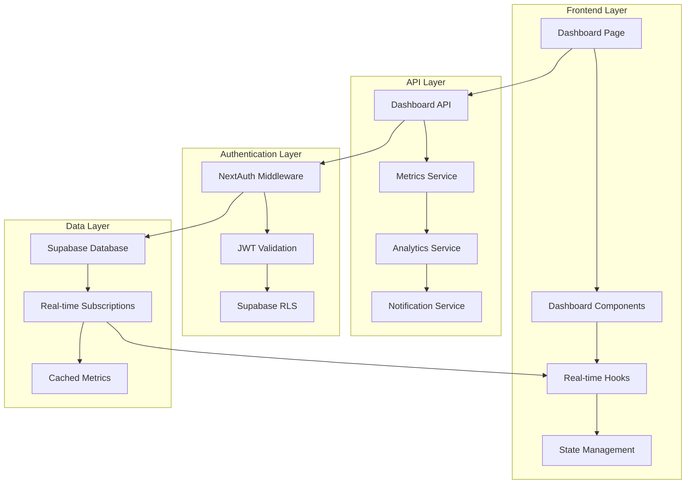
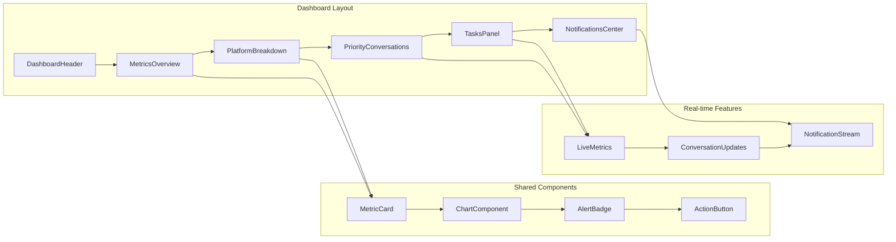
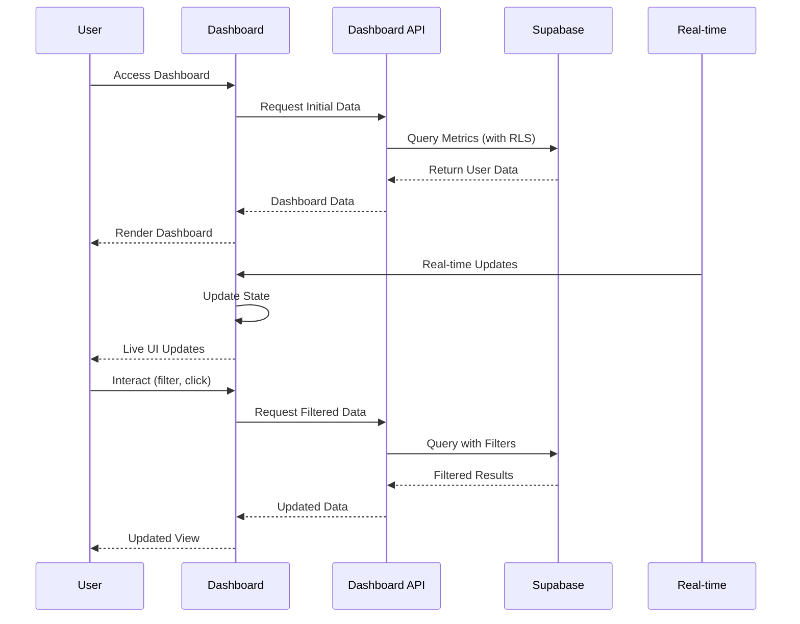

# Design Document - Dashboard de Mensajería Unificada

## Overview

El dashboard mejorado de SincroGoo será el centro neurálgico de la plataforma de mensajería unificada, diseñado específicamente para emprendedores que necesitan gestionar múltiples canales de comunicación desde una interfaz centralizada. El diseño se enfoca en proporcionar información actionable en tiempo real, minimizar la pérdida de oportunidades comerciales y optimizar el flujo de trabajo de atención al cliente.

### Principios de Diseño

1. **Información Actionable**: Cada métrica y elemento visual debe llevar a una acción específica
2. **Tiempo Real**: Los datos deben actualizarse automáticamente sin intervención del usuario
3. **Priorización Inteligente**: El sistema debe destacar automáticamente lo más importante
4. **Personalización**: Adaptable a diferentes tipos de negocio y flujos de trabajo
5. **Integración Nativa**: Aprovechar completamente la arquitectura existente de SincroGoo

## Architecture

### High-Level Architecture



### Component Architecture



## Components and Interfaces

### Core Components

#### 1. DashboardLayout
```typescript
interface DashboardLayoutProps {
  user: User;
  preferences: DashboardPreferences;
  children: React.ReactNode;
}

interface DashboardPreferences {
  layout: 'compact' | 'expanded' | 'custom';
  visibleSections: string[];
  refreshInterval: number;
  notifications: NotificationSettings;
  focusMode: boolean;
}
```

#### 2. MetricsOverview
```typescript
interface MetricsOverviewProps {
  timeRange: TimeRange;
  realTimeData: LiveMetrics;
  comparisonEnabled: boolean;
}

interface LiveMetrics {
  activeConversations: number;
  pendingResponses: number;
  averageResponseTime: number;
  conversionRate: number;
  platformBreakdown: PlatformMetrics[];
  trends: MetricTrend[];
}

interface PlatformMetrics {
  platform: 'whatsapp' | 'telegram' | 'email';
  messageCount: number;
  responseRate: number;
  averageResponseTime: number;
  connectionStatus: 'connected' | 'disconnected' | 'error';
}
```

#### 3. PriorityConversations
```typescript
interface PriorityConversationsProps {
  conversations: PriorityConversation[];
  onConversationClick: (conversationId: string) => void;
  onMarkImportant: (conversationId: string, important: boolean) => void;
}

interface PriorityConversation {
  id: string;
  leadName: string;
  platform: Platform;
  lastMessage: string;
  timeSinceLastResponse: number;
  priority: 'high' | 'medium' | 'low';
  isMarkedImportant: boolean;
  leadValue: number;
  unreadCount: number;
}
```

#### 4. TasksPanel
```typescript
interface TasksPanelProps {
  tasks: Task[];
  onTaskComplete: (taskId: string) => void;
  onTaskSnooze: (taskId: string, snoozeTime: number) => void;
}

interface Task {
  id: string;
  type: 'follow_up' | 'first_response' | 'scheduled_contact';
  leadId: string;
  leadName: string;
  description: string;
  dueDate: Date;
  priority: 'high' | 'medium' | 'low';
  isRecurring: boolean;
  recurringPattern?: RecurringPattern;
}
```

### API Interfaces

#### Dashboard Metrics API
```typescript
// GET /api/dashboard/metrics
interface DashboardMetricsResponse {
  overview: {
    activeConversations: number;
    pendingResponses: number;
    averageResponseTime: number;
    conversionRate: number;
  };
  platformBreakdown: PlatformMetrics[];
  timeSeriesData: TimeSeriesPoint[];
  alerts: Alert[];
}

// GET /api/dashboard/priority-conversations
interface PriorityConversationsResponse {
  conversations: PriorityConversation[];
  totalCount: number;
  hasMore: boolean;
}

// GET /api/dashboard/tasks
interface TasksResponse {
  tasks: Task[];
  overdueTasks: Task[];
  upcomingTasks: Task[];
}
```

#### Real-time Subscriptions
```typescript
interface RealtimeSubscription {
  channel: string;
  event: string;
  callback: (payload: any) => void;
}

// Supabase Real-time channels
const subscriptions = [
  'dashboard_metrics',
  'priority_conversations',
  'task_updates',
  'notification_stream'
];
```

## Data Models

### Database Schema Extensions

#### dashboard_preferences Table
```sql
CREATE TABLE dashboard_preferences (
  id UUID PRIMARY KEY DEFAULT gen_random_uuid(),
  usuario_id UUID REFERENCES usuarios(id) ON DELETE CASCADE,
  layout_type VARCHAR(20) DEFAULT 'expanded',
  visible_sections JSONB DEFAULT '[]',
  refresh_interval INTEGER DEFAULT 30,
  notification_settings JSONB DEFAULT '{}',
  focus_mode BOOLEAN DEFAULT false,
  custom_objectives JSONB DEFAULT '{}',
  created_at TIMESTAMP WITH TIME ZONE DEFAULT NOW(),
  updated_at TIMESTAMP WITH TIME ZONE DEFAULT NOW()
);

-- RLS Policy
ALTER TABLE dashboard_preferences ENABLE ROW LEVEL SECURITY;
CREATE POLICY "Users can only access their own preferences" ON dashboard_preferences
  FOR ALL USING (auth.uid() = usuario_id);
```

#### dashboard_metrics_cache Table
```sql
CREATE TABLE dashboard_metrics_cache (
  id UUID PRIMARY KEY DEFAULT gen_random_uuid(),
  usuario_id UUID REFERENCES usuarios(id) ON DELETE CASCADE,
  metric_type VARCHAR(50) NOT NULL,
  time_range VARCHAR(20) NOT NULL,
  data JSONB NOT NULL,
  expires_at TIMESTAMP WITH TIME ZONE NOT NULL,
  created_at TIMESTAMP WITH TIME ZONE DEFAULT NOW()
);

-- Index for efficient lookups
CREATE INDEX idx_dashboard_metrics_cache_lookup 
ON dashboard_metrics_cache(usuario_id, metric_type, time_range, expires_at);
```

#### tasks Table
```sql
CREATE TABLE tasks (
  id UUID PRIMARY KEY DEFAULT gen_random_uuid(),
  usuario_id UUID REFERENCES usuarios(id) ON DELETE CASCADE,
  lead_id UUID REFERENCES leads(id) ON DELETE CASCADE,
  conversation_id UUID REFERENCES conversaciones(id) ON DELETE SET NULL,
  task_type VARCHAR(50) NOT NULL,
  title VARCHAR(255) NOT NULL,
  description TEXT,
  due_date TIMESTAMP WITH TIME ZONE,
  priority VARCHAR(10) DEFAULT 'medium',
  status VARCHAR(20) DEFAULT 'pending',
  is_recurring BOOLEAN DEFAULT false,
  recurring_pattern JSONB,
  completed_at TIMESTAMP WITH TIME ZONE,
  created_at TIMESTAMP WITH TIME ZONE DEFAULT NOW(),
  updated_at TIMESTAMP WITH TIME ZONE DEFAULT NOW()
);

-- RLS Policy
ALTER TABLE tasks ENABLE ROW LEVEL SECURITY;
CREATE POLICY "Users can only access their own tasks" ON tasks
  FOR ALL USING (auth.uid() = usuario_id);
```

### Data Flow Architecture



## Error Handling

### Error Categories and Responses

#### 1. Authentication Errors
```typescript
interface AuthError {
  type: 'AUTH_ERROR';
  code: 'TOKEN_EXPIRED' | 'INVALID_SESSION' | 'INSUFFICIENT_PERMISSIONS';
  message: string;
  redirectTo?: string;
}

// Error handling strategy
const handleAuthError = (error: AuthError) => {
  switch (error.code) {
    case 'TOKEN_EXPIRED':
      // Trigger token refresh
      return refreshToken();
    case 'INVALID_SESSION':
      // Redirect to login
      return redirect('/auth/signin');
    case 'INSUFFICIENT_PERMISSIONS':
      // Show permission error
      return showPermissionError();
  }
};
```

#### 2. Data Loading Errors
```typescript
interface DataError {
  type: 'DATA_ERROR';
  code: 'NETWORK_ERROR' | 'SERVER_ERROR' | 'TIMEOUT';
  message: string;
  retryable: boolean;
}

// Retry strategy with exponential backoff
const retryStrategy = {
  maxRetries: 3,
  baseDelay: 1000,
  maxDelay: 10000,
  backoffFactor: 2
};
```

#### 3. Real-time Connection Errors
```typescript
interface RealtimeError {
  type: 'REALTIME_ERROR';
  code: 'CONNECTION_LOST' | 'SUBSCRIPTION_FAILED' | 'CHANNEL_ERROR';
  affectedChannels: string[];
}

// Reconnection strategy
const reconnectionStrategy = {
  autoReconnect: true,
  maxReconnectAttempts: 5,
  reconnectInterval: 2000
};
```

## Testing Strategy

### Unit Testing
- **Components**: Test individual dashboard components with mock data
- **Hooks**: Test custom hooks for data fetching and real-time updates
- **Utils**: Test utility functions for data processing and formatting
- **API Routes**: Test API endpoints with different authentication scenarios

### Integration Testing
- **Authentication Flow**: Test complete auth flow with NextAuth and Supabase
- **Real-time Updates**: Test Supabase real-time subscriptions
- **Data Consistency**: Test data synchronization between components
- **Error Scenarios**: Test error handling and recovery mechanisms

### End-to-End Testing
- **User Workflows**: Test complete user journeys through the dashboard
- **Cross-browser**: Test compatibility across different browsers
- **Performance**: Test loading times and real-time update performance
- **Mobile Responsiveness**: Test dashboard functionality on mobile devices

### Testing Tools and Framework
```typescript
// Jest + React Testing Library for unit tests
import { render, screen, waitFor } from '@testing-library/react';
import { jest } from '@jest/globals';

// Cypress for E2E testing
describe('Dashboard E2E Tests', () => {
  it('should load dashboard with real-time updates', () => {
    cy.visit('/dashboard');
    cy.get('[data-testid="metrics-overview"]').should('be.visible');
    cy.get('[data-testid="live-indicator"]').should('contain', 'Live');
  });
});

// Mock Supabase for testing
const mockSupabase = {
  from: jest.fn().mockReturnThis(),
  select: jest.fn().mockReturnThis(),
  eq: jest.fn().mockReturnThis(),
  channel: jest.fn().mockReturnThis(),
  on: jest.fn().mockReturnThis(),
  subscribe: jest.fn()
};
```

## Performance Considerations

### Optimization Strategies

#### 1. Data Fetching Optimization
```typescript
// Implement intelligent caching
const useDashboardMetrics = (timeRange: TimeRange) => {
  return useSWR(
    ['dashboard-metrics', timeRange],
    () => fetchDashboardMetrics(timeRange),
    {
      refreshInterval: 30000, // 30 seconds
      revalidateOnFocus: false,
      dedupingInterval: 10000
    }
  );
};

// Batch API requests
const batchRequests = async (requests: ApiRequest[]) => {
  const batchedData = await Promise.allSettled(requests);
  return processBatchedResults(batchedData);
};
```

#### 2. Real-time Optimization
```typescript
// Throttle real-time updates
const useThrottledRealtime = (channel: string, interval: number = 1000) => {
  const [data, setData] = useState(null);
  const throttledUpdate = useCallback(
    throttle((newData) => setData(newData), interval),
    [interval]
  );
  
  useEffect(() => {
    const subscription = supabase
      .channel(channel)
      .on('*', throttledUpdate)
      .subscribe();
      
    return () => subscription.unsubscribe();
  }, [channel, throttledUpdate]);
  
  return data;
};
```

#### 3. Component Optimization
```typescript
// Memoize expensive calculations
const MemoizedMetricsChart = React.memo(({ data, timeRange }) => {
  const processedData = useMemo(() => {
    return processChartData(data, timeRange);
  }, [data, timeRange]);
  
  return <Chart data={processedData} />;
});

// Virtualize large lists
const VirtualizedConversationList = ({ conversations }) => {
  return (
    <FixedSizeList
      height={400}
      itemCount={conversations.length}
      itemSize={80}
      itemData={conversations}
    >
      {ConversationItem}
    </FixedSizeList>
  );
};
```

## Security Considerations

### Data Protection
- **RLS Enforcement**: All database queries must respect Row Level Security policies
- **JWT Validation**: Every API request validates the NextAuth JWT token
- **Input Sanitization**: All user inputs are sanitized before processing
- **Rate Limiting**: API endpoints implement rate limiting to prevent abuse

### Authentication Security
```typescript
// Secure API route example
export async function GET(request: NextRequest) {
  const session = await getServerSession(authOptions);
  
  if (!session?.user?.id) {
    return NextResponse.json({ error: 'Unauthorized' }, { status: 401 });
  }
  
  // Use session.supabaseToken for Supabase queries
  const supabase = createClient(
    process.env.NEXT_PUBLIC_SUPABASE_URL!,
    process.env.NEXT_PUBLIC_SUPABASE_ANON_KEY!,
    {
      global: {
        headers: {
          Authorization: `Bearer ${session.supabaseToken}`
        }
      }
    }
  );
  
  // Query with automatic RLS filtering
  const { data, error } = await supabase
    .from('dashboard_metrics')
    .select('*');
    
  return NextResponse.json(data);
}
```

### Privacy and Compliance
- **Data Minimization**: Only collect and display necessary data
- **Audit Logging**: Log all dashboard actions for security auditing
- **Session Management**: Implement secure session handling with proper expiration
- **HTTPS Enforcement**: All communications must use HTTPS in production