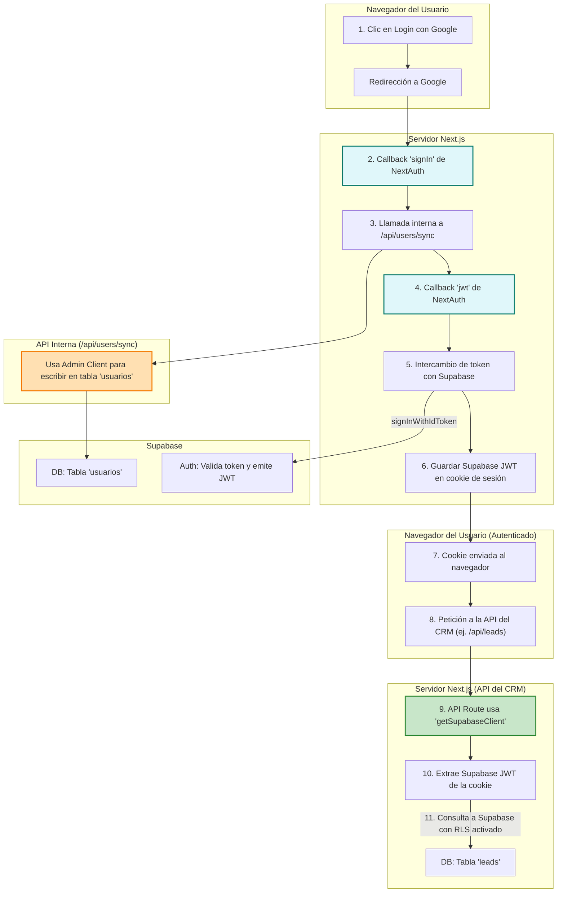

# Sistema de Autenticación de SincroGoo

Este documento describe el sistema de autenticación implementado en SincroGoo, utilizando NextAuth.js para la gestión de sesiones y Supabase como proveedor de base de datos y autenticación.

## Estructura General

La autenticación sigue un flujo robusto y seguro que ocurre completamente en el lado del servidor:

1.  **Login**: El usuario inicia sesión usando su cuenta de Google a través de NextAuth.
2.  **Callback `signIn`**: Inmediatamente después de una autenticación exitosa con Google, se dispara el callback `signIn` en el servidor.
3.  **Sincronización en Backend**: Dentro de este callback, se realiza una llamada de servidor a servidor al endpoint `/api/supabase/users/sync`. Este endpoint utiliza el **cliente de administrador de Supabase** para crear o actualizar el perfil del usuario en nuestra tabla `usuarios`, basándose en el `auth_id` de Google.
4.  **Callback `jwt`**: A continuación, se ejecuta el callback `jwt`. Aquí, se intercambia el `id_token` de Google por un JWT válido de Supabase.
5.  **Almacenamiento del Token**: Este JWT de Supabase se guarda dentro del token de sesión de NextAuth, que se cifra y se envía al cliente como una cookie segura (`httpOnly`).
6.  **Autorización en API**: Cuando el cliente realiza una petición a un endpoint protegido (ej. `/api/supabase/leads`), las funciones de la API utilizan `getSupabaseClient(true)`. Esta función extrae el `supabaseToken` de la sesión del usuario para realizar una llamada autenticada a Supabase que respeta las Políticas de Seguridad a Nivel de Fila (RLS).

## Componentes Clave

### 1. Callbacks de NextAuth (`options.ts`)

El archivo `src/app/api/auth/[...nextauth]/options.ts` es el núcleo del sistema.

-   **`signIn`**: Orquesta la sincronización del usuario. Llama a nuestra API interna para asegurar que cada usuario que inicia sesión tiene un registro correspondiente en la tabla `usuarios`.
    ```typescript
    // signIn callback
    if (account?.provider === 'google') {
      await fetch(`${baseUrl}/api/supabase/users/sync`, {
        method: 'POST',
        headers: { 'Content-Type': 'application/json' },
        body: JSON.stringify({
          auth_id: user.id,
          email: user.email,
          nombre: user.name,
          // ... otros datos del perfil
        }),
      });
    }
    ```
-   **`jwt`**: Se encarga de la autenticación con Supabase. Obtiene un token de sesión de Supabase y lo inyecta en el token de NextAuth.
    ```typescript
    // jwt callback
    if (account?.provider === 'google') {
      const { data, error } = await supabase.auth.signInWithIdToken({
        provider: 'google',
        token: account.id_token as string,
      });
      if (data?.session?.access_token) {
        token.supabaseToken = data.session.access_token;
      }
    }
    ```

### 2. API de Sincronización (`/api/supabase/users/sync`)

Este es un endpoint **interno y administrativo**. Su única función es recibir datos de un nuevo inicio de sesión y usar el cliente con privilegios de administrador (`supabaseAdmin`) para crear o actualizar un registro en la tabla `usuarios`. Esto centraliza la lógica y evita exponer operaciones sensibles al cliente.

### 3. Cliente de Supabase (`/lib/supabase/client.ts`)

-   **`getSupabaseAdmin()`**: Devuelve un cliente de Supabase con la `service_role_key`. Se usa exclusivamente en el backend para tareas administrativas que necesitan saltarse las políticas de RLS (como la sincronización de usuarios).
-   **`getSupabaseClient(requireAuth = true)`**: Se usa en los endpoints de la API que son llamados por el cliente. Obtiene la sesión de NextAuth, extrae el `supabaseToken`, y lo usa para autenticar al usuario en Supabase. Esto asegura que todas las consultas (SELECT, INSERT, UPDATE) respeten las RLS definidas.

## Flujo de Login y Sincronización

1.  El usuario hace clic en "Login con Google".
2.  NextAuth lo redirige a Google y, tras una autenticación exitosa, el callback `signIn` se ejecuta en el servidor.
3.  `signIn` llama a `/api/supabase/users/sync` para registrar al usuario en la tabla `usuarios`.
4.  El callback `jwt` intercambia el token de Google por un token de Supabase y lo añade a la sesión de NextAuth.
5.  Una cookie cifrada con la sesión de NextAuth (que contiene el token de Supabase) se envía al navegador.
6.  El usuario ya está autenticado y sincronizado. Cualquier llamada posterior a la API del CRM (ej. para obtener leads) utilizará el `supabaseToken` de la sesión para ejecutar consultas seguras bajo las reglas de RLS.

## Resumen y Ventajas del Flujo Actual

-   **Seguridad Mejorada**: La sincronización de usuarios es una operación de backend a backend. No se depende de un token enviado desde el cliente ni de componentes de UI para tareas críticas.
-   **Eficiencia**: La sincronización ocurre una sola vez, durante el inicio de sesión, en lugar de en cada carga de página.
-   **Robustez**: La lógica está centralizada en los callbacks de NextAuth, haciendo el flujo más predecible y fácil de depurar.
-   **Separación de incumbencias**: `getSupabaseAdmin` se usa para tareas de sistema, mientras que `getSupabaseClient` se usa para operaciones en nombre del usuario, respetando siempre la seguridad de sus datos (RLS).

## Diagrama visual del nuevo flujo



## Variables de Entorno Requeridas

# Google OAuth
GOOGLE_CLIENT_ID=tu_id_de_cliente_google
GOOGLE_CLIENT_SECRET=tu_secreto_de_cliente_google

# NextAuth
NEXTAUTH_URL=http://localhost:3000
NEXTAUTH_SECRET=tu_secreto_para_jwt

# Supabase
NEXT_PUBLIC_SUPABASE_URL=https://tu-proyecto.supabase.co
NEXT_PUBLIC_SUPABASE_ANON_KEY=tu_clave_anonima_de_supabase
SUPABASE_SERVICE_ROLE_KEY=tu_clave_de_servicio_para_el_backend

## Estructura de Archivos

src/
├── app/
│   ├── api/
│   │   └── auth/
│   │       ├── [...nextauth]/
│   │       │   ├── options.ts     # Configuración de NextAuth
│   │       │   └── route.ts       # Handlers de NextAuth
│   │       └── supabase/
│   │           └── users/
│   │               └── sync/      # Sincronización automática con Supabase
│   └── auth/
│       └── signin/
│           └── page.tsx           # Página de inicio de sesión
├── componentes/
│   └── SyncSupabaseUser.tsx       # Componente global de sincronización
├── lib/
│   └── supabase.ts                # Cliente de Supabase
└── types/
    └── next-auth.d.ts             # Declaración de tipos para NextAuth
```