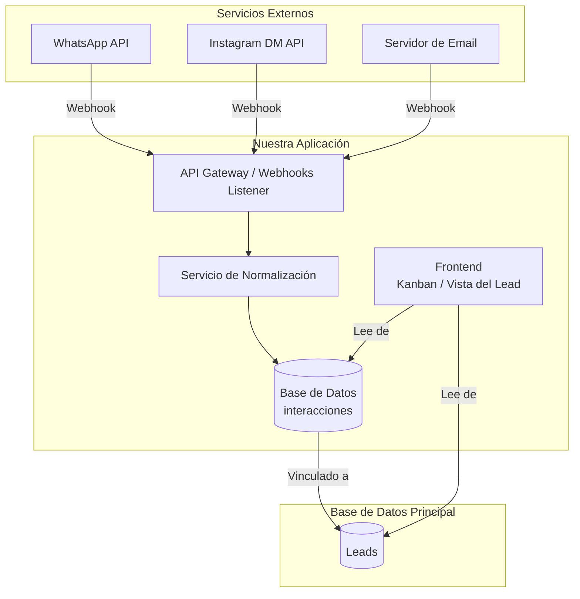

# Plan de Integración de Mensajería para CRM

Este documento describe la arquitectura y el plan de acción para integrar servicios de mensajería externos (como Email, WhatsApp, etc.) en nuestro sistema de CRM, centralizando todas las conversaciones en un único lugar.

## 1. Visión Arquitectónica: Hub de Comunicaciones Unificado

El objetivo es crear un sistema donde cada servicio de mensajería notifique a nuestro backend a través de **webhooks**. Nuestro backend "normalizará" estos mensajes y los guardará en una única tabla de interacciones, siempre vinculados a un lead. El frontend luego leerá de esta tabla para mostrar un historial unificado.

### Diagrama de Flujo de Datos

## 2. Estructura de la Base de Datos

Proponemos una nueva tabla `interacciones` para almacenar todos los mensajes de manera centralizada.

### Tabla `interacciones`

| Columna            | Tipo                     | Descripción                                               |
| ------------------ | ------------------------ | --------------------------------------------------------- |
| `id`               | `uuid` (PK)              | Identificador único de la interacción.                    |
| `lead_id`          | `uuid` (FK a `leads`)    | El lead al que pertenece este mensaje.                    |
| `servicio_origen`  | `text`                   | 'whatsapp', 'email', 'instagram_dm', 'sms', etc.          |
| `contenido`        | `text`                   | El cuerpo del mensaje. Podría ser texto plano o HTML.     |
| `tipo`             | `text`                   | 'entrante' o 'saliente'.                                  |
| `remitente`        | `text`                   | Quién envió el mensaje (email, número de teléfono, etc.). |
| `fecha_mensaje`    | `timestamp with time zone` | La fecha y hora exactas del mensaje.                      |
| `metadata`         | `jsonb`                  | Un campo flexible para datos específicos del servicio.    |

## 3. Clarificación de Conceptos: `Conversaciones` vs `Interacciones`

Para construir un sistema robusto, es crucial diferenciar dos tipos de registros que, aunque relacionados, tienen propósitos distintos. Por ello, propondremos dos tablas separadas:

### Tabla `Conversaciones` (o `MensajesExternos`)

*   **Propósito: ¿QUÉ DIJO EL CLIENTE?**
*   **Definición:** Registra de forma **automática y fiel** cada mensaje que entra o sale a través de canales externos (Email, WhatsApp, Instagram DM, etc.). Es el historial bruto de la comunicación.
*   **Ejemplos:**
    *   Un email que llega a las 10:05 AM.
    *   Un WhatsApp que un agente responde a las 10:15 AM.
    *   Un mensaje recibido desde un formulario de contacto.
*   **Trigger:** Un mensaje en esta tabla *puede* crear un nuevo lead si el remitente no existe. Si el lead ya existe, el mensaje simplemente se añade a su historial.

### Tabla `Interacciones` (o `Actividades`)

*   **Propósito: ¿QUÉ HIZO NUESTRO EQUIPO SOBRE EL LEAD?**
*   **Definición:** Registra las **acciones, notas y tareas manuales** que el equipo realiza internamente. Es el bloc de notas y el planificador de acciones del CRM.
*   **Ejemplos:**
    *   `{tipo: 'Llamada', descripcion: 'Hablé con Juan, parece interesado.'}`
    *   `{tipo: 'Tarea', descripcion: 'Preparar propuesta técnica.'}`
    *   `{tipo: 'Nota', descripcion: 'Cliente mencionó que su presupuesto es limitado.'}`
*   **Trigger:** Creada manualmente por un usuario del CRM después de una acción que no se registra automáticamente (como una llamada) o para planificar trabajo futuro.

Ambas tablas trabajan juntas para dar una visión de 360 grados del lead: lo que **dijo el cliente** (`Conversaciones`) y lo que **hicimos nosotros al respecto** (`Interacciones`).

## 4. Plan de Acción Incremental

Abordaremos la implementación en fases para asegurar un desarrollo controlado y funcional.

### Fase 1: La Base del Sistema
- [x] **Crear la tabla `interacciones` en la base de datos.**
- [x] **Crear la tabla `conversaciones` en la base de datos.**
  - [x] Escribir y ejecutar el script SQL para crear la tabla con la estructura definida.
  - [x] Establecer la relación de clave foránea (`lead_id`, `usuario_id`).
  - [x] Añadir los índices necesarios para optimizar las consultas.

### Fase 2: Primera Integración (Email Entrante)
- [ ] **Configurar un servicio de parseo de email.**
  - [ ] Elegir y configurar un servicio (ej. SendGrid Inbound Parse, Mailgun Routes).
- [ ] **Crear el endpoint de Webhook.**
  - [ ] Crear una nueva ruta en la API: `/api/integrations/incoming/email`.
  - [ ] Implementar la lógica para recibir y validar la petición del webhook.
- [ ] **Crear el servicio de normalización para email.**
  - [ ] Desarrollar un `email-parser.ts` que tome el JSON del webhook.
  - [ ] Extraer la información relevante (remitente, contenido, fecha).
  - [ ] Mapear la información al schema de nuestra tabla `interacciones`.
- [ ] **Guardar la interacción.**
  - [ ] Implementar la lógica para buscar el `lead_id` correspondiente al email del remitente.
  - [ ] Guardar el objeto normalizado en la tabla `interacciones`.

### Fase 3: Integración con el Frontend
- [ ] **Crear el componente `HistorialInteracciones`.**
  - [ ] Desarrollar un componente que reciba un `lead_id` como prop.
  - [ ] Hacer una llamada a la API para obtener todas las interacciones de ese lead.
  - [ ] Renderizar las interacciones en orden cronológico, mostrando origen, contenido y fecha.
- [ ] **Integrar el componente en la vista del Lead.**
  - [ ] Añadir el componente `HistorialInteracciones` a la barra lateral `FormularioEdicionLead.tsx`.
  - [ ] Considerar añadir pestañas para separar "Detalles del Lead" y "Actividad/Mensajes".
- [ ] **(Opcional) Implementar actualizaciones en tiempo real.**
  - [ ] Usar Supabase Realtime para suscribirse a los cambios en la tabla `interacciones`.
  - [ ] Actualizar la interfaz de usuario automáticamente cuando llegue un nuevo mensaje.

### Fase 4: Expandir a Otros Servicios (Ej. WhatsApp)
- [ ] **Configurar la API del nuevo servicio.**
  - [ ] Configurar la API de Meta for Business para WhatsApp.
  - [ ] Configurar y verificar el webhook para recibir notificaciones de nuevos mensajes.
- [ ] **Desarrollar un nuevo normalizador.**
  - [ ] Crear un `whatsapp-handler.ts` que entienda el formato de los webhooks de Meta.
  - [ ] Implementar la lógica para normalizar los datos y guardarlos en la tabla `interacciones`.
- [ ] **Actualizar el frontend para mostrar iconos/estilos específicos del servicio.**
  - [ ] Mostrar un icono de WhatsApp junto a los mensajes que vengan de ese servicio.

### Fase 5: Habilitar Mensajes Salientes
- [ ] **Desarrollar servicios de envío.**
  - [ ] Crear un `MessagingService` en el backend con métodos como `enviarEmail`, `enviarWhatsApp`.
  - [ ] Estos métodos usarán las APIs correspondientes de los servicios externos (SendGrid, Meta API).
- [ ] **Crear la interfaz de respuesta en el frontend.**
  - [ ] Añadir un campo de texto y un botón de "Enviar" en el `HistorialInteracciones`.
  - [ ] Al enviar, se llamará a la API de nuestro backend, que a su vez usará el `MessagingService`.
  - [ ] El mensaje enviado también se guardará en la tabla `interacciones` con el tipo 'saliente'. 