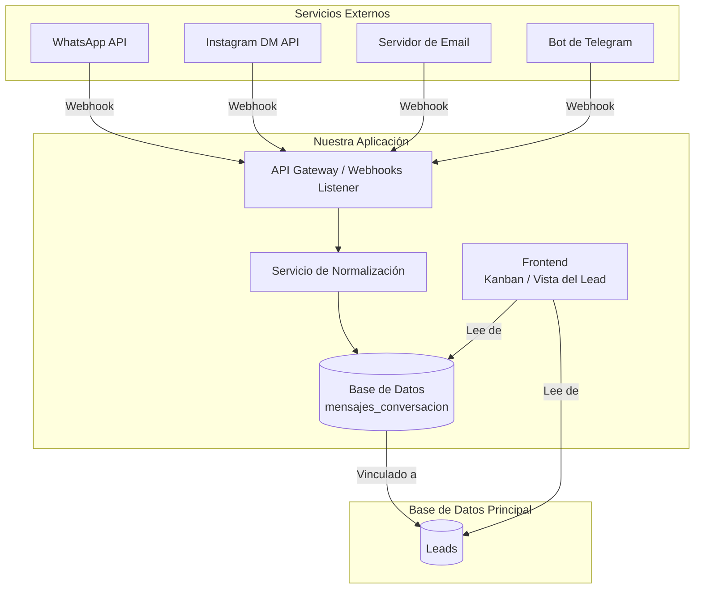
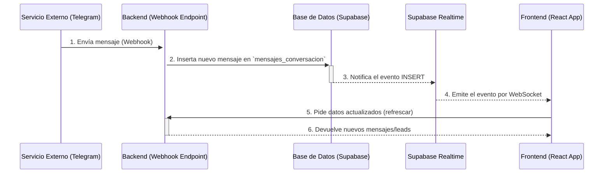

# Plan de Integración de Mensajería para CRM

Este documento describe la arquitectura y el plan de acción para integrar servicios de mensajería externos (como Email, WhatsApp, etc.) en nuestro sistema de CRM, centralizando todas las conversaciones en un único lugar.

## 1. Visión Arquitectónica: Hub de Comunicaciones Unificado

El objetivo es crear un sistema donde cada servicio de mensajería notifique a nuestro backend a través de **webhooks**. Nuestro backend "normalizará" estos mensajes y los guardará en una única tabla de interacciones, siempre vinculados a un lead. El frontend luego leerá de esta tabla para mostrar un historial unificado.

### Diagrama de Flujo de Datos

## 2. Flujo de Datos en Tiempo Real (Realtime)

La actualización en tiempo real no se basa en un "webhook de realtime", sino en una combinación del webhook de entrada con el servicio de **Supabase Realtime** basado en WebSockets. El flujo es el siguiente:

1.  **Entrada (Webhook):** Un servicio externo (como Telegram) envía un nuevo mensaje a nuestro endpoint de webhook (`/api/integrations/incoming/...`).
2.  **Procesamiento y Escritura:** Nuestro backend procesa la petición, la normaliza y la inserta como una nueva fila en la tabla `mensajes_conversacion` de nuestra base de datos.
3.  **Difusión (Broadcast):** La inserción en la base de datos es detectada por el servicio de Supabase Realtime, que automáticamente envía una notificación sobre este cambio a todos los clientes que estén escuchando.
4.  **Recepción y Actualización (Cliente):**
    *   Nuestro frontend mantiene una conexión WebSocket persistente con Supabase.
    *   Cuando recibe la notificación del nuevo mensaje, el evento actúa como una señal para que el frontend vuelva a solicitar los datos actualizados (ej. `refrescarLeads()` o `fetchMensajes()`).
    *   La interfaz se actualiza con la información más reciente.

### Diagrama de Secuencia del Flujo Realtime

## 3. Estructura de la Base de Datos

Proponemos una nueva tabla `interacciones` para almacenar todos los mensajes de manera centralizada.

### Tabla `interacciones`

| Columna            | Tipo                     | Descripción                                               |
| ------------------ | ------------------------ | --------------------------------------------------------- |
| `id`               | `uuid` (PK)              | Identificador único de la interacción.                    |
| `lead_id`          | `uuid` (FK a `leads`)    | El lead al que pertenece este mensaje.                    |
| `servicio_origen`  | `text`                   | 'whatsapp', 'email', 'instagram_dm', 'sms', etc.          |
| `contenido`        | `text`                   | El cuerpo del mensaje. Podría ser texto plano o HTML.     |
| `tipo`             | `text`                   | 'entrante' o 'saliente'.                                  |
| `remitente`        | `text`                   | Quién envió el mensaje (email, número de teléfono, etc.). |
| `fecha_mensaje`    | `timestamp with time zone` | La fecha y hora exactas del mensaje.                      |
| `metadata`         | `jsonb`                  | Un campo flexible para datos específicos del servicio.    |

## 4. Clarificación de Conceptos: `Conversaciones` vs `Interacciones`

Para construir un sistema robusto, es crucial diferenciar dos tipos de registros que, aunque relacionados, tienen propósitos distintos. Por ello, propondremos dos tablas separadas:

### Tabla `Conversaciones` (o `MensajesExternos`)

*   **Propósito: ¿QUÉ DIJO EL CLIENTE?**
*   **Definición:** Registra de forma **automática y fiel** cada mensaje que entra o sale a través de canales externos (Email, WhatsApp, Instagram DM, etc.). Es el historial bruto de la comunicación.
*   **Ejemplos:**
    *   Un email que llega a las 10:05 AM.
    *   Un WhatsApp que un agente responde a las 10:15 AM.
    *   Un mensaje recibido desde un formulario de contacto.
*   **Trigger:** Un mensaje en esta tabla *puede* crear un nuevo lead si el remitente no existe. Si el lead ya existe, el mensaje simplemente se añade a su historial.

### Tabla `Interacciones` (o `Actividades`)

*   **Propósito: ¿QUÉ HIZO NUESTRO EQUIPO SOBRE EL LEAD?**
*   **Definición:** Registra las **acciones, notas y tareas manuales** que el equipo realiza internamente. Es el bloc de notas y el planificador de acciones del CRM.
*   **Ejemplos:**
    *   `{tipo: 'Llamada', descripcion: 'Hablé con Juan, parece interesado.'}`
    *   `{tipo: 'Tarea', descripcion: 'Preparar propuesta técnica.'}`
    *   `{tipo: 'Nota', descripcion: 'Cliente mencionó que su presupuesto es limitado.'}`
*   **Trigger:** Creada manualmente por un usuario del CRM después de una acción que no se registra automáticamente (como una llamada) o para planificar trabajo futuro.

Ambas tablas trabajan juntas para dar una visión de 360 grados del lead: lo que **dijo el cliente** (`Conversaciones`) y lo que **hicimos nosotros al respecto** (`Interacciones`).

## 5. Plan de Acción Incremental

Abordaremos la implementación en fases para asegurar un desarrollo controlado y funcional.

### Fase 1: La Base del Sistema ✅ COMPLETADO
- [x] **Crear la tabla `interacciones` en la base de datos.**
- [x] **Crear la tabla `conversaciones` en la base de datos.**
  - [x] Escribir y ejecutar el script SQL para crear la tabla con la estructura definida.
  - [x] Establecer la relación de clave foránea (`lead_id`, `usuario_id`).
  - [x] Añadir los índices necesarios para optimizar las consultas.

### Fase 2: Integración con Telegram ✅ COMPLETADO
- [x] **Configurar la API del servicio.**
  - [x] Configurar y verificar el webhook para recibir notificaciones de nuevos mensajes de Telegram.
- [x] **Crear el endpoint de Webhook.**
  - [x] Crear ruta en la API: `/api/integrations/incoming/telegram`.
  - [x] Implementar la lógica para recibir y validar la petición del webhook.
- [x] **Crear el servicio de normalización.**
  - [x] Desarrollar `telegram-handler.ts` que tome el JSON del webhook.
  - [x] Extraer la información relevante (remitente, contenido, fecha).
  - [x] Mapear la información al schema de nuestras tablas.
- [x] **Guardar mensajes.**
  - [x] Implementar la lógica para buscar/crear conversaciones.
  - [x] Guardar mensajes normalizados en `mensajes_conversacion`.

### Fase 3: Chat Unificado ✅ COMPLETADO
- [x] **Crear página de chat unificada.**
  - [x] Implementar `/chat` como página principal de comunicaciones.
  - [x] Añadir navegación al menú principal del sistema.
- [x] **Desarrollar componentes de chat.**
  - [x] `ChatSidebar` - Lista de conversaciones con indicadores por plataforma.
  - [x] `ChatWindow` - Ventana principal de chat con mensajes.
  - [x] `MessageBubble` - Burbujas de mensajes diferenciadas.
  - [x] `MessageInput` - Input unificado para responder.
  - [x] `ConversationHeader` - Header con información del contacto.
- [x] **Implementar API endpoints para chat.**
  - [x] `/api/chat/conversaciones` - Obtener lista de conversaciones.
  - [x] `/api/chat/mensajes` - Obtener mensajes de una conversación.
  - [x] `/api/chat/enviar` - Enviar mensajes (guardado en BD).
- [x] **Integración con tiempo real.**
  - [x] Usar Supabase Realtime para actualizaciones automáticas.
  - [x] Hook personalizado `useChat` para manejo de estado.

### Fase 4: Primera Integración Email (PENDIENTE)
- [ ] **Configurar un servicio de parseo de email.**
  - [ ] Elegir y configurar un servicio (ej. SendGrid Inbound Parse, Mailgun Routes).
- [ ] **Crear el endpoint de Webhook.**
  - [ ] Crear una nueva ruta en la API: `/api/integrations/incoming/email`.
  - [ ] Implementar la lógica para recibir y validar la petición del webhook.
- [ ] **Crear el servicio de normalización para email.**
  - [ ] Desarrollar un `email-handler.ts` que tome el JSON del webhook.
  - [ ] Extraer la información relevante (remitente, contenido, fecha).
  - [ ] Mapear la información al schema de nuestras tablas.
- [ ] **Guardar la interacción.**
  - [ ] Implementar la lógica para buscar el `lead_id` correspondiente al email del remitente.
  - [ ] Guardar el objeto normalizado en las tablas correspondientes.

### Fase 4: Expandir a Otros Servicios (Ej. WhatsApp)
- [ ] **Configurar la API del nuevo servicio.**
  - [ ] Configurar la API de Meta for Business para WhatsApp.
  - [ ] Configurar y verificar el webhook para recibir notificaciones de nuevos mensajes.
- [ ] **Desarrollar un nuevo normalizador.**
  - [ ] Crear un `whatsapp-handler.ts` que entienda el formato de los webhooks de Meta.
- [ ] **Actualizar el frontend para mostrar iconos/estilos específicos del servicio.**
  - [ ] Mostrar un icono de WhatsApp junto a los mensajes que vengan de ese servicio.

### Fase 5: Habilitar Mensajes Salientes
- [ ] **Desarrollar servicios de envío.**
  - [ ] Crear un `MessagingService` en el backend con métodos como `enviarEmail`, `enviarWhatsApp`.
  - [ ] Estos métodos usarán las APIs correspondientes de los servicios externos (SendGrid, Meta API).
- [ ] **Crear la interfaz de respuesta en el frontend.**
  - [ ] Añadir un campo de texto y un botón de "Enviar" en el `HistorialInteracciones`.
  - [ ] Al enviar, se llamará a la API de nuestro backend, que a su vez usará el `MessagingService`.
  - [ ] El mensaje enviado también se guardará en la tabla `interacciones` con el tipo 'saliente'.

### Fase 4: Integración con Telegram
- [x] **Configurar la API del nuevo servicio.**
  - [x] Configurar y verificar el webhook para recibir notificaciones de nuevos mensajes de Telegram.
- [x] **Desarrollar un nuevo normalizador.**
  - [x] Crear un `telegram-handler.ts` que entienda el formato de los webhooks de Telegram.
- [x] **Actualizar el frontend para mostrar iconos/estilos específicos del servicio.**
  - [x] Mostrar un icono de Telegram junto a los mensajes que vengan de ese servicio.

### Fase 5: Chat Unificado (COMPLETADO ✅)
- [x] **Crear página de chat unificada.**
  - [x] Implementar `/chat` como página principal de comunicaciones.
  - [x] Añadir navegación al menú principal del sistema.
- [x] **Desarrollar componentes de chat.**
  - [x] `ChatSidebar` - Lista de conversaciones con indicadores por plataforma.
  - [x] `ChatWindow` - Ventana principal de chat con mensajes.
  - [x] `MessageBubble` - Burbujas de mensajes diferenciadas (entrantes/salientes).
  - [x] `MessageInput` - Input unificado para responder a cualquier plataforma.
  - [x] `ConversationHeader` - Header con información del contacto.
- [x] **Implementar API endpoints para chat.**
  - [x] `/api/chat/conversaciones` - Obtener lista de conversaciones activas.
  - [x] `/api/chat/mensajes` - Obtener mensajes de una conversación específica.
  - [x] `/api/chat/enviar` - Enviar mensajes (guardado en BD, envío externo pendiente).
- [x] **Crear hook personalizado de chat.**
  - [x] `useChat` - Manejo centralizado del estado del chat.
  - [x] Integración con Supabase Realtime para actualizaciones automáticas.
- [x] **Interfaz de usuario completa.**
  - [x] Diseño responsive y moderno.
  - [x] Indicadores visuales por plataforma (Telegram, WhatsApp, Email).
  - [x] Tiempo real funcionando correctamente.

### Fase 6: Habilitar Mensajes Salientes (EN PROGRESO 🔄)
- [ ] **Implementar envío real a Telegram.**
  - [ ] Configurar `TELEGRAM_BOT_TOKEN` en variables de entorno.
  - [ ] Implementar función `enviarTelegram()` usando Bot API.
  - [ ] Probar envío bidireccional completo.
- [ ] **Implementar envío a WhatsApp Business.**
  - [ ] Configurar Meta Business API y tokens.
  - [ ] Crear función `enviarWhatsApp()`.
  - [ ] Implementar webhook de WhatsApp para mensajes entrantes.
- [ ] **Implementar envío de Email.**
  - [ ] Configurar SendGrid o Mailgun.
  - [ ] Crear función `enviarEmail()`.
  - [ ] Implementar webhook de email entrante.
- [ ] **Mejorar UX de envío.**
  - [ ] Estados de mensaje: enviado, entregado, leído.
  - [ ] Indicador de "escribiendo..." en tiempo real.
  - [ ] Manejo de errores de envío con reintentos. 